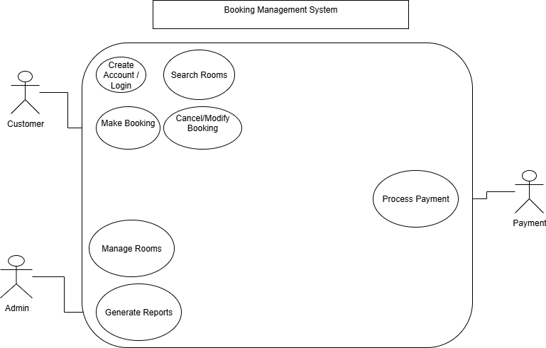

# requirement-analysis
A learning and documentation repository for exploring Requirement Analysis in the Software Development Lifecycle (SDLC). It covers the definition, importance, key activities, types of requirements, use case diagrams, and acceptance criteria, using a booking management system as a case study.
# Requirement Analysis in Software Development

This repository contains learning material and examples related to Requirement Analysis in the Software Development Lifecycle (SDLC).  
The purpose of this repository is to document key concepts, activities, and examples of requirement analysis, particularly in the context of a booking management system case study.
## What is Requirement Analysis?

Requirement Analysis is the process of identifying, gathering, and analyzing the needs and expectations of stakeholders for a software system.  
It acts as the foundation of the Software Development Lifecycle (SDLC) by ensuring that the final product meets business goals, user expectations, and technical feasibility.

Through requirement analysis, developers and analysts capture **what the system should do** and **how it should behave**. It bridges the communication gap between stakeholders (such as clients, users, and managers) and the development team.

In summary, requirement analysis ensures that the software is built with a clear understanding of:
- The problem to be solved.
- The features to be included.
- The constraints to be respected.
- The success criteria to be achieved.
## Why is Requirement Analysis Important?

Requirement Analysis is a critical step in the Software Development Lifecycle (SDLC) because it lays the groundwork for the entire project. Without it, software teams risk building systems that do not meet user needs or business objectives.  

Here are three key reasons why it is important:

1. **Prevents Misunderstandings**  
   Clear requirements ensure that all stakeholders (clients, users, and developers) share the same understanding of what the system should do. This reduces miscommunication and costly rework later.

2. **Guides Design and Development**  
   Well-documented requirements serve as a roadmap for developers and designers, helping them create features that align with business goals and user expectations.

3. **Ensures Quality and User Satisfaction**  
   Requirement Analysis establishes measurable criteria for testing and validation, ensuring the final product works as intended and satisfies user needs.
## Key Activities in Requirement Analysis

Requirement Analysis involves several structured activities that help capture, refine, and validate the needs of stakeholders. The five key activities are:

- **Requirement Gathering**  
  Collecting initial information from stakeholders through interviews, questionnaires, observations, or workshops to understand what the system should achieve.

- **Requirement Elicitation**  
  Engaging stakeholders actively to uncover hidden needs, clarify assumptions, and resolve conflicts in requirements.

- **Requirement Documentation**  
  Recording the requirements clearly and systematically using tools like Software Requirement Specification (SRS) documents, diagrams, and user stories.

- **Requirement Analysis and Modeling**  
  Analyzing the gathered requirements for feasibility, consistency, and completeness, and representing them using models such as data flow diagrams or use case diagrams.

- **Requirement Validation**  
  Ensuring that the documented requirements truly reflect stakeholder needs and can be implemented within the project’s scope, budget, and timeline.
## Types of Requirements

In software development, requirements are generally classified into two main categories: **Functional Requirements** and **Non-functional Requirements**. Both are essential to ensure the system delivers value and performs effectively.

### Functional Requirements
Functional requirements define **what the system should do**. They describe the features, services, and behaviors of the system from the user’s perspective.

**Examples (Booking Management System):**
- The system shall allow users to create an account and log in.
- The system shall enable customers to search for available rooms based on date and location.
- The system shall allow users to book, cancel, or modify reservations.
- The system shall generate booking confirmation and send it via email.

### Non-functional Requirements
Non-functional requirements define **how the system should perform**. They specify quality attributes, constraints, and performance expectations.

**Examples (Booking Management System):**
- The system shall handle up to 5000 concurrent users without performance degradation.
- The system shall provide a response time of less than 3 seconds for search queries.
- The system shall ensure data security using encryption and secure authentication.
- The system shall be available 99.9% of the time (high availability).
## Use Case Diagrams

A Use Case Diagram is a visual representation of the interactions between **actors** (users or other systems) and the system itself. It helps to illustrate the functional requirements by showing what the system should do from the user’s perspective.

### Benefits of Use Case Diagrams
- Provides a clear and simple way to capture system functionality.
- Enhances communication between stakeholders and developers.
- Serves as a foundation for creating test cases and validating requirements.

### Booking Management System Use Case Diagram
Below is an example use case diagram for a booking system. It shows the main actors (Customer, Admin, and Payment System) and their interactions with the system.

